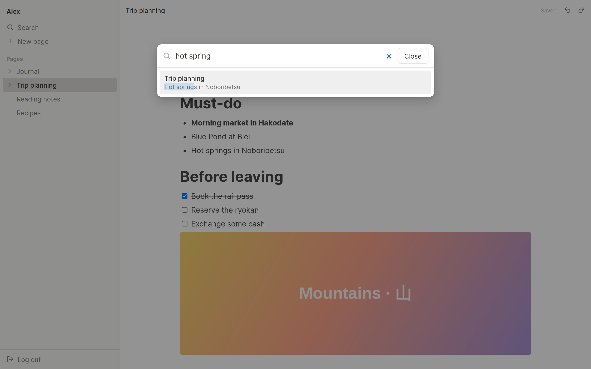
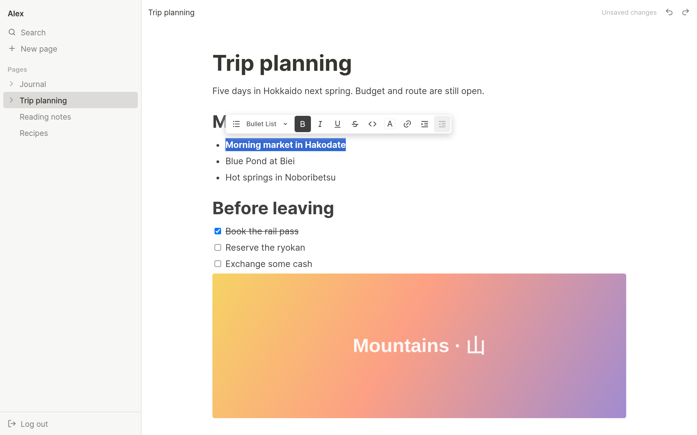
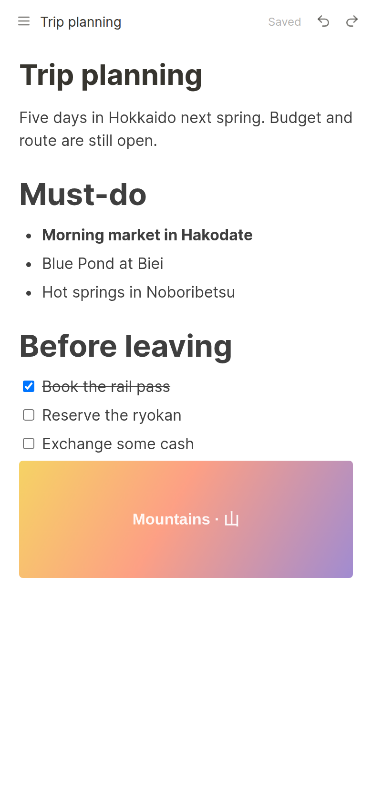

# CoteBook

**English** · [繁體中文](README.zh-TW.md)

An open-source, self-hostable notes app for one person, built around a Notion-style
block editor. Run it on your own server with a single `docker compose up`.


| Search                            | Formatting toolbar                             | Mobile                                                        |
| --------------------------------- | ---------------------------------------------- | ------------------------------------------------------------- |
|  |  |  |

## Features

- **Block editor**: paragraphs, headings (H1–H3), bulleted, numbered and to-do lists,
  and images. Type `/` to insert blocks and drag the handle to reorder them.
- **Rich text**: bold, italic, underline, strikethrough, inline code, links and text color.
  Undo and redo are available from the keyboard and from buttons, so they also work on phones.
- **Nested pages**: pages can contain subpages to any depth. The sidebar page tree supports
  drag-and-drop for reordering and nesting, with touch support.
- **Search**: finds matches in page titles and content. Substring matching also works for
  Chinese, Japanese and other languages without spaces between words.
- **Cross-device sync**: changes from your other devices appear live. Two devices that edit
  the same page at once get a conflict prompt instead of silently overwriting each other.
- **Responsive**: the same web app works on desktop and in mobile browsers.
- **Self-hosted**: one Docker Compose file runs the app and PostgreSQL. Everything is
  configured through environment variables. Images are stored on local disk or any
  S3-compatible service.
- **Demo mode**: with `DATABASE_ENABLED=false`, CoteBook runs without PostgreSQL and
  opens an unsaved demo of the editor. See
  [Running without a database](docs/self-hosting.md#running-without-a-database-demo-mode).
- **Interface languages**: English and Traditional Chinese.

## Quick start (self-hosting)

Requirements: Docker with the Compose plugin.

```bash
git clone https://github.com/CyclopesTsai/CoteBook.git
cd CoteBook
cp .env.example .env
# Edit .env: set POSTGRES_PASSWORD and APP_URL at minimum.
docker compose up -d
```

Open <http://localhost:3000> and create your account. On a personal instance, set
`ALLOW_REGISTRATION=false` afterwards and run `docker compose up -d` again so nobody else
can sign up.

> **Note:** Password reset is not available yet. If you forget your password, you can't
> recover the account on your own. Store your password in a password manager.

For HTTPS, reverse proxies, backups, upgrades and S3 storage, see
**[docs/self-hosting.md](docs/self-hosting.md)**.

## Development

```bash
npm install
cp .env.example .env    # point DATABASE_URL at a local PostgreSQL
npm run dev             # API on :3000, web client on :5173
```

See **[docs/development.md](docs/development.md)** for the full setup, project layout and
conventions, and **[docs/architecture.md](docs/architecture.md)** for the data model and
the HTTP API.

## Status

This is the first (MVP) release of the [product specification](docs/spec.zh-TW.md).

| Area      | Included now                                                                                               | Planned later                                                                                                           |
| --------- | ---------------------------------------------------------------------------------------------------------- | ----------------------------------------------------------------------------------------------------------------------- |
| Accounts  | Email and password sign-in                                                                                 | Dark theme. The database is already prepared for password reset, email verification, 2FA, and Google and Apple sign-in. |
| Pages     | Create, rename and delete pages; nesting; drag-and-drop tree. Deletes are soft, so pages stay recoverable. | Trash and restore, icons and covers, favorites, copy, lock                                                              |
| Editor    | The blocks and formatting listed above, slash menu, block drag, undo/redo                                  | Toggles, quotes, code blocks, tables, columns, math, …                                                                  |
| Media     | Image upload                                                                                               | Files, video, audio, embeds                                                                                             |
| Sharing   | Not yet. The share-link table, read-only page view and central permission checks are in place.             | Read-only share links                                                                                                   |
| Search    | Titles and content                                                                                         | Quick switcher (Ctrl/Cmd + K), filters, backlinks                                                                       |
| Platforms | Responsive web app, live cross-device sync. The API is designed so native apps can use it directly.        | iOS and Android apps, desktop app, offline editing                                                                      |

## Tech stack

- **Server**: Node.js, Fastify, PostgreSQL, Drizzle ORM (migrations run automatically on
  startup), argon2id password hashing, Server-Sent Events over Postgres `LISTEN/NOTIFY`
- **Web**: React, Vite, [BlockNote](https://www.blocknotejs.org/) (ProseMirror),
  TanStack Query, dnd-kit, i18next
- **Shared**: a TypeScript/zod package that defines the API contract, reusable by future
  native clients

## License

[GNU Affero General Public License v3.0](LICENSE) (AGPL-3.0-only).

You may use, modify and self-host CoteBook freely. If you run a modified version as a
network service for other people, you must make your modified source code available to
those users. All third-party dependencies use licenses compatible with the AGPL
(MIT, Apache-2.0, MPL-2.0, ISC, BSD, CC0).
