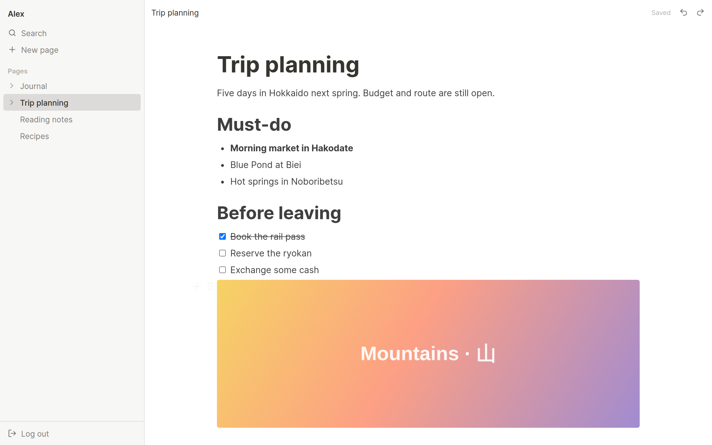

# CoteBook

[English](README.md) · **繁體中文**

開源、可自行架設的個人筆記工具，以類 Notion 的區塊式編輯器為核心。只要一行
`docker compose up`，就能在自己的伺服器上執行。



## 功能

- **區塊式編輯器**：段落、標題（H1–H3）、項目符號與編號清單、待辦核取方塊、圖片。輸入
  `/` 快速插入區塊，拖曳左側把手即可重新排序。
- **文字格式**：粗體、斜體、底線、刪除線、行內程式碼、連結、文字顏色。復原／重做可用鍵盤，
  也有按鈕，手機上同樣能用。
- **巢狀頁面**：頁面可包含子頁面，層級不限。側邊欄頁面樹支援拖曳排序與巢狀調整，也支援觸控操作。
- **全域搜尋**：搜尋頁面標題與內容。採用子字串比對，中文、日文等沒有空格分詞的語言也能正確搜尋。
- **跨裝置同步**：其他裝置上的修改會即時出現。兩台裝置同時編輯同一頁時，會跳出衝突提示讓你選擇，
  不會互相默默覆蓋。
- **響應式網頁**：同一個網頁版可在桌機與手機瀏覽器上使用。
- **自行架設**：一個 Docker Compose 檔即可啟動應用程式與 PostgreSQL。所有設定都透過環境變數，
  圖片可存放在本機磁碟或任何 S3 相容儲存。
- **展示模式**：在 `.env` 設定 `DATABASE_ENABLED=false`，就能在不啟動 PostgreSQL 的情況下執行，
  網頁會開啟不會儲存的展示用編輯器，資料庫容器也不會啟動。詳見
  [Running without a database](docs/self-hosting.md#running-without-a-database-demo-mode)（英文）。
- **介面語言**：英文、繁體中文。

## 快速開始（自行架設）

需求：Docker 與 Compose 外掛。

```bash
git clone https://github.com/CyclopesTsai/CoteBook.git
cd CoteBook
cp .env.example .env
# 編輯 .env：至少設定 POSTGRES_PASSWORD 與 APP_URL
docker compose up -d
```

開啟 <http://localhost:3000> 建立帳號。個人使用時，建立帳號後建議將
`ALLOW_REGISTRATION=false`，再執行一次 `docker compose up -d`，避免他人註冊。

> **注意**：目前尚未提供「忘記密碼」功能，忘記密碼將無法自行找回帳號，請使用密碼管理工具妥善保存。

HTTPS、反向代理、備份、升級與 S3 儲存設定，請參考
**[docs/self-hosting.md](docs/self-hosting.md)**（英文）。

## 開發

```bash
npm install
cp .env.example .env    # 將 DATABASE_URL 指向本機 PostgreSQL
npm run dev             # API 在 :3000，網頁在 :5173
```

詳見 **[docs/development.md](docs/development.md)** 與
**[docs/architecture.md](docs/architecture.md)**。原始需求規格：
**[docs/spec.zh-TW.md](docs/spec.zh-TW.md)**。

## 授權

[GNU Affero General Public License v3.0](LICENSE)（AGPL-3.0-only）。

可自由使用、修改與自行架設。若將修改後的版本架設成網路服務提供他人使用，必須向這些使用者公開修改後的原始碼。
